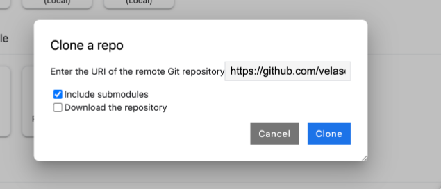
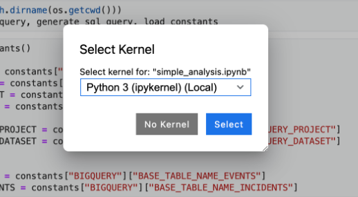

# Telco Data AI Lab

This repository contains a number of labs to lilustrate the use of Google Cloud Data and AI products using a telco networking equipment incident dataset

## Setup

Once logged into a Google Cloud Project, open Cloud Shell and execute the following commands:

```bash
gcloud services enable bigqueryconnection.googleapis.com
gcloud services enable notebooks.googleapis.com
gcloud services enable cloudresourcemanager.googleapis.com
gcloud services enable aiplatform.googleapis.com
gcloud services enable bigquery.googleapis.com
gcloud services enable iam.googleapis.com
gcloud services enable documentai.googleapis.com
gcloud services enable cloudaicompanion.googleapis.com


PROJECT_ID=$(gcloud config get-value project)
PROJECT_NUM=$(gcloud projects list --filter="$PROJECT_ID" --format="value(PROJECT_NUMBER)")

gcloud projects add-iam-policy-binding $PROJECT_ID \
      --member="serviceAccount:${PROJECT_NUM}-compute@developer.gserviceaccount.com"\
      --role='roles/aiplatform.serviceAgent'

gcloud projects add-iam-policy-binding $PROJECT_ID \
      --member="serviceAccount:${PROJECT_NUM}-compute@developer.gserviceaccount.com"\
      --role='roles/artifactregistry.admin'

gcloud projects add-iam-policy-binding $PROJECT_ID \
        --member="serviceAccount:${PROJECT_NUM}-compute@developer.gserviceaccount.com" \
        --role='roles/bigquery.connectionAdmin'

gcloud projects add-iam-policy-binding $PROJECT_ID \
      --member="serviceAccount:${PROJECT_NUM}-compute@developer.gserviceaccount.com"\
      --role='roles/storage.admin'

gcloud projects add-iam-policy-binding $PROJECT_ID \
      --member="serviceAccount:${PROJECT_NUM}@cloudbuild.gserviceaccount.com"\
      --role='roles/aiplatform.admin'

gcloud projects add-iam-policy-binding $PROJECT_ID \
      --member="serviceAccount:$PROJECT_NUM-compute@developer.gserviceaccount.com"\
      --role='roles/resourcemanager.projectIamAdmin'
```

**NOTE:** You can find a shell script under `telco_data_ai_lab/setup/enable_apis.sh`

Next, navigate to Vertex AI > Workbench and create a new notebook of `INSTANCES` type.

Leave all the configuration as default.
Once the notebook is created, click on `OPEN JUPYTERLAB` to open the web interface.
Click on Git > Clone a Repository and enter the following URL `https://github.com/velascoluis/telco_data_ai_lab.git`.



Now, open and execute notebook under `telco_data_ai_lab/setup/env_setup.ipynb`

This concludes the lab setup.

**NOTE:** The data is already generated and hosted on a public bucket, but we supply the data generation scrips, they are located on the `src/datagen` folde

## Labs

Now you can follow the lab instructions on the following notebooks.

You can run all of them with de default Python3 kernel



- Lab #1: Simple data analysis
  - [Code](src/data_analysis/simple_analysis.ipynb)
- Lab #2: Traditional ML
  - [Code](src/incident_classifier/random_forest_classifier.ipynb)
- Lab #3: Generative AI
  - [Code](src/gen_ai_docs/gen_ai_bq.ipynb)

## Prep labs (optional)

- [Getting started with VertexAI Gemini API and Python SDK (Lab)](https://www.cloudskillsboost.google/focuses/86503?catalog_rank=%7B%22rank%22%3A4%2C%22num_filters%22%3A0%2C%22has_search%22%3Atrue%7D&parent=catalog&search_id=35761283)
- [Getting started with VertexAI Studio (Lab)](https://www.cloudskillsboost.google/focuses/86502?catalog_rank=%7B%22rank%22%3A1%2C%22num_filters%22%3A0%2C%22has_search%22%3Atrue%7D&parent=catalog&search_id=35761339)
- [Build and Deploy Machine Learning Solutions on Vertex AI (Course)](https://www.cloudskillsboost.google/course_templates/684?catalog_rank=%7B%22rank%22%3A5%2C%22num_filters%22%3A0%2C%22has_search%22%3Atrue%7D&search_id=35761493)
- [Feature Engineering (Course)](https://www.cloudskillsboost.google/course_templates/11?catalog_rank=%7B%22rank%22%3A2%2C%22num_filters%22%3A0%2C%22has_search%22%3Atrue%7D&search_id=35761546)